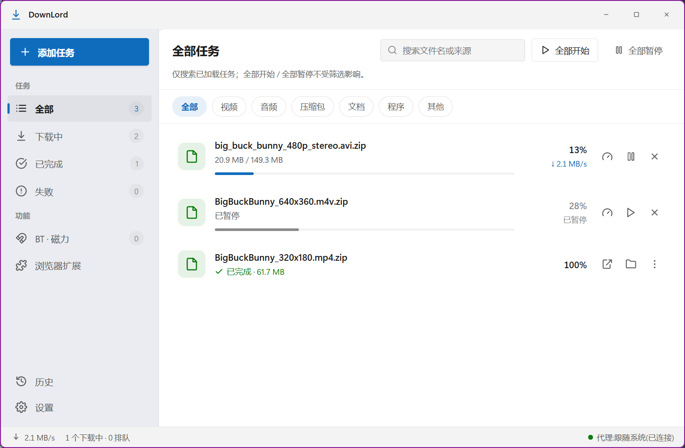
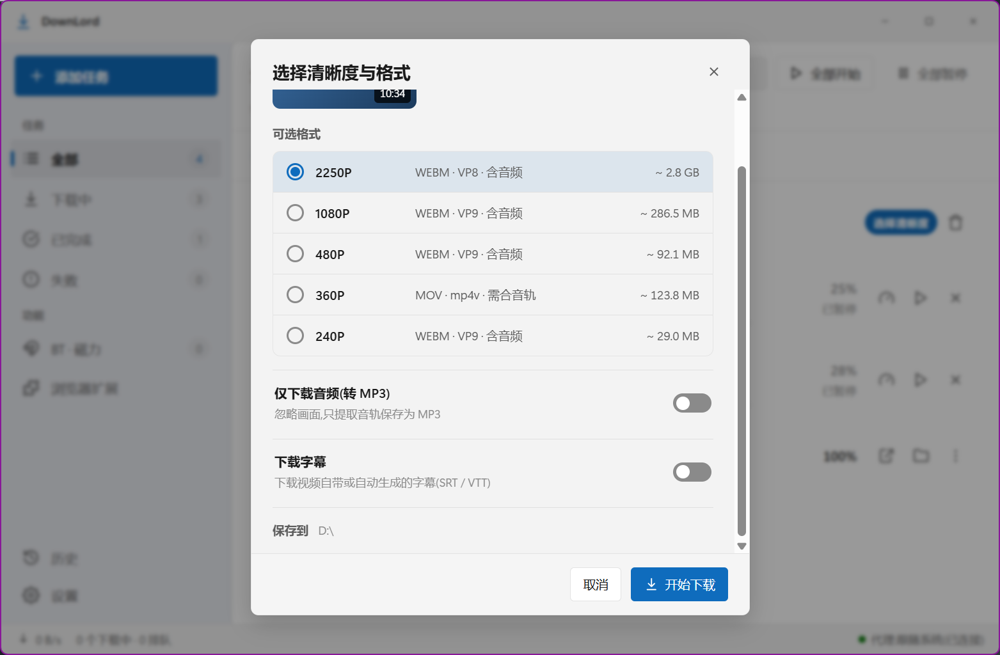
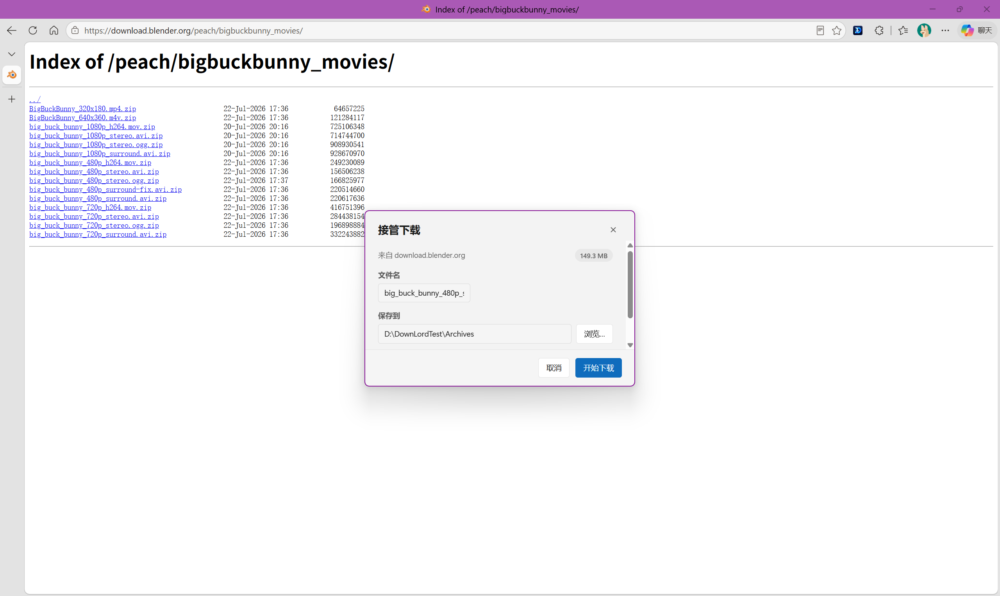
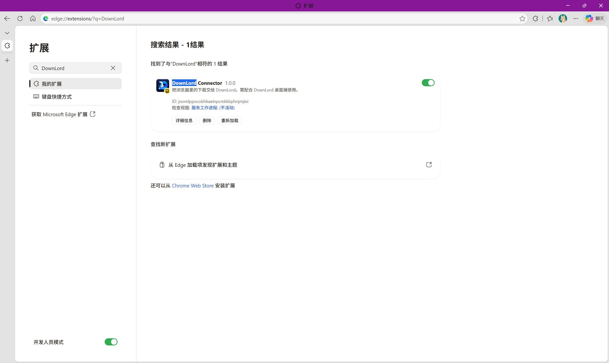

# DownLord

Windows x64 桌面下载器，把直链、视频、BT / 磁力下载放进同一份任务列表与下载历史。

- **直链下载**：多线程、断点续传、下载限速、重复检测与按文件类别归类。
- **视频下载**：站点解析、清晰度选择、提取音频、字幕与批量添加；具体站点仍受上游和登录态限制。
- **BT / 磁力**：种子信息获取、文件选择、节点与上传状态、可选做种。
- **浏览器协作（选装）**：下载接管、网页媒体嗅探、按需借用本人登录态。
- **本地运行**：aria2 / yt-dlp / FFmpeg 随安装包内置，以独立子进程运行；支持直连、系统代理、手动代理三档。

**本文对应 1.0.0。** 安装包与更新资产以 GitHub Releases 页为准；自更新的真实升级闭环尚未验证（留首个 v1.0.x）。历史变化见 [CHANGELOG](CHANGELOG.md)，漏洞报告见 [SECURITY](SECURITY.md)。

> 工具中立：不提供代理节点、不承诺规避网络封锁。下载和分享内容前，请确认版权授权与平台服务条款（ToS）允许。

[快速上手](#quick-start) · [功能与限制](#features-and-limits) · [Cookie 与隐私](#cookies) · [更新与数据](#updates-and-data) · [源码构建](#build) · [许可与合规](#compliance) · [社区](#community)

## 实机截图

以下均为当前构建的真实运行截图（Windows 11），演示任务使用有公开许可的素材，不是原型或生成图。



主窗口：三条演示任务分别处于下载中、已暂停、已完成；顶部搜索框只筛选当前已加载的任务。



视频下载：粘贴视频页链接并选“作为视频解析”后，任务上出现“选择清晰度”，打开的面板列出实际解析到的格式；可选格式取决于站点与 yt-dlp，不保证任意站点都能解析。



浏览器协作：在 Edge 点击下载，扩展把请求转交 DownLord，弹出独立的“接管下载”确认窗等待你确认；截图时尚未点“开始下载”。需要先按下文[装扩展 + 配对](#extension-setup)。

> 演示素材：《Big Buck Bunny》© 2008 Blender Foundation / [www.bigbuckbunny.org](https://peach.blender.org/about/)，按 [CC BY 3.0](https://creativecommons.org/licenses/by/3.0/) 使用；主窗口与接管图只出现文件名，视频面板含影片缩略图的一角。仅用于 DownLord 功能演示，不代表原作者背书；本仓库不分发影片文件。

<a id="quick-start"></a>

## 快速上手

### 安装（Windows x64）

1. 从本仓库的 GitHub Releases 页取得对应版本的 `downlord-<version>-setup.exe`；本文不内嵌未经核验的下载资产直链。
2. 双击安装包，按 NSIS 向导完成安装；安装程序创建桌面与开始菜单快捷方式。
3. 打开 DownLord，先在设置中确认默认下载目录及所需代理，再添加任务。

**未签名 / SmartScreen**：当前维持不做代码签名，Windows 可能显示“Windows 已保护你的电脑”或“未知发布者”。这既不单独证明应用有恶意，也不是安全保证。只有在你自行确认来源可信后，才考虑点“更多信息 → 仍要运行”；来源不明时不要继续。不承诺签名时间，也不承诺签名能消除全部告警。

### 添加第一个任务

- **普通文件**：粘贴直链，确认文件名和保存位置后下载。HTTP 自动取名会先探测重定向与响应文件名；探测不支持或失败时使用链接中的名称，手动指定的名称优先。服务端可能在探测与正式下载时返回不同信息。
- **视频**：粘贴单视频链接，解析后选择实际可用的清晰度、音频或字幕选项。需要登录时先阅读 [Cookie 来源与限制](#cookies)，不要反复尝试不适用的读取方式。
- **BT / 磁力**：粘贴 magnet 或选本地 `.torrent` 文件。先获取种子信息，再按清单选择文件；单文件种子直接开始。元数据阶段的进度不能当作文件下载进度。

不装扩展仍可使用直链、视频与 BT 下载；浏览器接管、网页嗅探和“从扩展获取 Cookie”需要选装扩展。

<a id="extension-setup"></a>

### 装扩展 + 配对

> **前提**：已装好 DownLord。以下步骤在 **Edge 和 Chrome 上已实测通过，两者均为本版承诺范围；Firefox 扩展本版不做**。这里沿用既有实测记录，不是本轮新增测试；[浏览器支持范围](#browser-support)同时适用于接管、嗅探和扩展 Cookie。

DownLord Connector **未上任何扩展商店**，不打 `.crx`，必须以开发者模式手动加载。扩展随安装包放在 `<安装目录>\resources\extension`，也提供同版本的 `downlord-extension-<version>.zip` 供单独分发。没有强制安装流程或一键安装。

**1. 启用本地通道。** 在 DownLord“设置 → 浏览器扩展”打开“启用本地通道”，第一行应显示 `监听中 · 127.0.0.1:52330`。

- 若提示“端口 52330 被占用，通道未启动”，改成其它端口（如 `52340`），点“重新绑定”，记住新数字。
- 应用不自行顺延端口、不扫描端口；冲突时如实不启动，由你选择。

**2. 加载扩展。** 选择一种来源：

- **安装版（推荐）**：通常位于 `%LOCALAPPDATA%\Programs\DownLord\resources\extension`；自定义安装时以实际目录为准。设置分组底部的“复制路径”或“在资源管理器中定位”使用运行时算出的真实路径。
- **ZIP**：先解压该版本扩展 ZIP，再选择解压得到的扩展目录。
- **开发者**：在仓库运行 `npm run build` 后，加载 `<仓库根>\extension\dist`。

在 Edge 地址栏手输或粘贴 `edge://extensions/`，在 Chrome 使用 `chrome://extensions/`；打开“开发人员模式 / 开发者模式”，点“加载解压缩的扩展”，选上面的目录。列表应出现 **DownLord Connector**。浏览器内部页需要自行打开，应用没有一键跳转。



加载完成后的样子：开发人员模式已开，DownLord Connector 卡片显示与应用同号的版本并处于启用状态。“加载解压缩的扩展”按钮在管理页未搜索时的顶部工具条中，本图的搜索结果视图不显示它。

> **不要选 `extension/` 源目录。** 源 `manifest.json` 刻意不含 `version`（由构建从根 `package.json` 注入），且只有 TypeScript 源码；不能直接当可加载产物。

**3. 配对。** 打开工具栏中的扩展弹窗，端口填第 1 步的数字（默认 `52330`）；从 DownLord 复制配对码，粘贴后点“保存并连接”。**配对码相当于密码，不要截图或分享。**

**4. 确认连接结果。** 扩展结果行显示“已连接 DownLord（应用 vX）”；DownLord 设置页第二行显示“已连接”。

- DownLord 的“未配对 / 已连接 / 待活动”依据是否握手及最近活动；没有定期心跳，“待活动”**不等于断开**，也可能只是空闲的扩展后台被浏览器回收。
- 扩展里的“配对码 · 已保存 / 未保存”只说明是否存过码，不能证明码正确。配对是否成功要看结果行。

| 改动 | 含义与后续操作 |
| --- | --- |
| 配对码 | 64 位字符的身份凭据；点“重新生成”才变，旧码立即失效，须回扩展粘贴新码。 |
| 端口 | 连接参数，不等于重新配对；应用改为 N 后，扩展也要填 N，不会自动跟随。非默认端口会有提醒和常驻生效值。 |

| 弹窗提示 | 排查方法 |
| --- | --- |
| 连不上 DownLord | 确认应用运行、本地通道打开、两侧端口一致。 |
| 配对码不被接受 | 从 DownLord 重新复制，检查是否曾重新生成。 |
| 协议版本不一致 | 按提示升级较旧的一侧。 |
| 端口上的服务没有按 DownLord 协议应答 | 可能是其它程序占用；在 DownLord 换端口，再将扩展改成同一个数字。 |

扩展没有独立自动更新通道，随应用一起更新。升级重写 `resources` 后，安装版扩展可能需要回 Edge / Chrome 扩展管理页手动重新加载。开发调试与重载见 [扩展说明](extension/README.md)。

<a id="features-and-limits"></a>

## 功能与限制

<a id="browser-support"></a>

### 浏览器支持范围（如实说明）

- **Edge**：已实测通过，属于承诺范围。
- **Chrome**：**已实测通过，与 Edge 同为承诺范围**。
- **Firefox 扩展**：**本版不做**。不同引擎、后台形态及分发签名要求需要单独处理，预留适配口不等于已支持。
- 不将上述结论泛化为所有 Chromium 浏览器已验证。这里说的是扩展的**接管、嗅探、Cookie**能力，不是外部程序读取浏览器 Cookie 数据库的支持表。

### 浏览器下载接管

在浏览器点普通文件下载，扩展转交 DownLord，并**请求浏览器取消原下载**。DownLord 弹独立确认窗口，可改落点或取消；没有静默加入任务的流程。重复下载在同一窗口中提供覆盖、跳过、重命名、打开已有文件四选一。

- 临时不想接管时，在扩展弹窗点“暂停接管”并选时长；状态真源在 DownLord，扩展只是遥控入口。
- 域名例外表支持精确 / 后缀匹配，在设置页管理。
- “已请求浏览器取消”**不等于确认取消成功**；若原下载此前已完成，文件可能仍在浏览器下载目录中。
- 只面向普通文件下载，不接管浏览器内部页或扩展自己发起的请求。浏览器若已判出危险则不接管（尽力而为），**不是可靠的恶意文件拦截**。
- HTTP 403/404 与 aria2 码 22 的失败指引会提醒：链接可能已失效；若从浏览器发起，可回浏览器重新点一次下载取得新链接。这是人工操作指引，**不识别任务来源、不自动重取链接，也不保证重试成功**。

### 网页媒体嗅探

1. 打开扩展弹窗，手动打开“嗅探”（**默认关闭**）。
2. 点“强制刷新本页”；开关打开前的请求没有被观察到，普通刷新又可能命中缓存。页面不会自动刷新，以免丢失表单内容。
3. 查看“视频流”（m3u8 / mpd，交 yt-dlp）与“媒体文件”（mp4 / webm / flv / mp3 / m4a，交 aria2）。
4. 选中条目点下载，在 DownLord 独立窗口确认后加入任务。

**会遇到的限制：**

- 只呈现当前标签页资源；只识别部分扩展名与 Content-Type。空列表不证明页面没有视频。
- 分片不单列，“已聚合 N 片”是浏览器**到目前请求过的片数**，不是总片数，不能用来判断资源完整性。
- 小于 1MB 的媒体请求默认隐藏，隐藏数量会说明；最多 50 条，超限也会提示。
- 一个页面可能有多条清单。扩展不读取内容，不猜主清单、不按主次排序；选到单路清单可能只有一种清晰度，不表示所有条目都能成功下载。
- 转交的下载请求头仅带 `Referer` 与 `User-Agent`，**不把 Cookie 混进该请求头白名单**。另行启用“从扩展获取”时，Cookie 走独立的按需通道，见下节。
- 嗅探候选按标签页留在浏览器会话存储，不进 DownLord 数据库或文件；关浏览器清空。没有点选的候选不会作为嗅探列表上报 DownLord，也不上报远端。

<a id="cookies"></a>

### Cookie：扩展内读取与外部读取是两种能力

Cookie 使用的是**你本人已经登录的会话**，不是代登录功能，不提供账号、密码或 Cookie，不破解会员、不绕过付费墙、不保证受限内容可下载。

“设置 → 视频 → Cookie 来源”有不使用、从浏览器读取、从文件、从扩展获取等选择。**扩展在浏览器内部读 Cookie，不能据此推导 yt-dlp 从外部读取同一浏览器数据库也可用。**

| 外部读取浏览器数据库 | 既有 N 域裁决记载的结果（本轮未重测） |
| --- | --- |
| Edge / Chrome | 运行中与关闭后均失败；ABE / 数据库保护不是简单关浏览器就能解决。 |
| Firefox | 运行中与关闭后均成功。Firefox 扩展本版不做，不影响这条直接读取路径。 |
| brave / chromium / opera / vivaldi | **未实测、同 Chromium 预计受限**；不是四种浏览器的已测失败结论。 |

读取失败会如实报错，**不静默降级，不无条件要求关闭浏览器**。可以改用 Firefox、自己导出的 `cookies.txt` 文件，或在无需登录时手动选择“不使用”。这段说明不改变视频引擎既有的自动降级策略。

**从扩展获取如何工作：**

- 只在你点击下载时，由 DownLord 从**已有候选站点**中点名，扩展才读取该站 Cookie；点名最多两个域，不是任意站点读取接口。
- **只读、不写、不删除浏览器 Cookie，不后台批量收集**；没点过的站不读。
- 绕开扩展直接粘贴 URL，且会话内此前从未经扩展借过该站登录态时，这一档取不到 Cookie。本地通道没有应用向扩展主动推送索取的路径；需要该档时，从扩展一侧发起操作。
- host 别名只覆盖**同端口的 `www.X / X`**，不承诺任意父子域或跨端口共享。

**两层生命周期不能混说：**

| 数据 | 保留与删除 |
| --- | --- |
| DownLord 的暂借登录态 | 只在会话内存，关闭应用即消失，也可在 Cookie 来源旁点“清除”；不写数据库、配置或日志，连域名也不写 Cookie 日志。**不会每次下载后自动清空整个会话。** |
| 交给单次 yt-dlp 的临时 Cookie 文件 | 随该次进程退出删除；应用启动时清扫异常残留。它的删除不等于上面的会话内存已清空。 |

**确认窗口不是 Cookie 到达的闸门。** Cookie 可能在你确认前已经进入 DownLord 内存；取消下载不会撤回已经取得的登录态，需要时请显式清除。不要把“按需读取”理解成没有风险。

### 扩展权限与本地通道的安全边界

安装时可能出现“读取您在所有网站上的数据”“读取和更改您在所有网站上的 Cookie”等提示。**权限声明确实比实际行为宽**，不是提示文案错误，也不能靠默认关闭把已授予权限取消。

| 权限 | 实际用途与边界 |
| --- | --- |
| `downloads` | 接收普通文件下载意图，受理后请求浏览器取消原下载。 |
| `webRequest`（观察型） | 看请求地址、必要请求头与响应头以识别媒体；不改请求、不注入脚本、不读页面正文。 |
| `cookies` | 点击下载后，只读取 DownLord 点名的候选站点；不写、不删除、不后台收集。 |
| `storage` | 保存配对参数；嗅探候选按标签页保存在会话存储。 |
| `host_permissions` | `http://127.0.0.1/*` 与 `<all_urls>`。MV3 该写法不限定端口，是回环全端口授权，不能说成只授权 52330。 |

嗅探默认关、不注入页面脚本、不记录浏览历史，扩展日志不写网址，扩展协作请求只发往本机回环通道。候选不远传等行为约束，**不是权限已收窄或“其实没有风险”**。动态 host 授权与全局监听器的组合尚未实测，本版不据此改变权限，也不承诺商店分发或后续排期。

- 通道默认关闭，只监听 `127.0.0.1`，不能配置为局域网或外网监听。
- 请求须带正确配对码（放请求头，不进 URL）；跨源预检不放行。网页 JS 与同用户权限的本机程序不是同一个威胁边界。
- 使用 **HTTP，不是 HTTPS**。回环流量不出网卡，但同机其它程序仍可能观察或访问。
- 配对码明文位于 `%APPDATA%\DownLord\config\extensionChannel.json`，扩展侧保存在浏览器配置中。能以你的用户身份读文件的程序可能取得它。
- **端口冒占风险仍在**：扩展连接的端口可能被其它本机程序占用；配对码不是对服务器身份的强证明，不承诺抵抗同用户程序。遇到异常先检查占用与两侧配置。
- 关闭通道会停用扩展协作，已有配对码仍有效，重新打开可继续用。不宣称绝对安全、加密传输或保证不被其它程序访问。

### BT / 磁力与做种

- 多文件种子在开始下载前选择；开始后不改选，需要换文件时删除任务重新添加。
- 除速度与百分比外，显示节点数；速度为 0 时区分寻找节点与已连接但等待数据。
- 内容放在默认下载目录下的 `Torrents`，按种子名称建子目录，不按扩展名分类。
- **下载完默认停止上传**；继续做种必须主动开启。可设置分享率 / 时长上限（先到者停止）和最大连接数，也可随时“停止做种”，保留已下载文件与续传信息。
- **做种即上传**，是向同一资源的其他用户分享内容；默认关闭的是下载完成后的继续做种，不意味着 BT 下载阶段不是互传。请确认分享授权。应用不内置种子索引或资源聚合。

**连通性不作保证。** NAT、路由器、运营商或防火墙可能使上传长期为 0，不等于软件故障。设置中的入站可达自检只读本机网络接口，不联网、不改网络设置；“可能可达”只说明检测到公网 IPv6，仍取决于外部是否能连入。UPnP / NAT-PMP 本体不做，不承诺自动打通端口，也不保证上传速度。

**tracker 热更新**在添加 BT 任务、距上次更新超过 12 小时时按需拉取公共列表；也可手动“立即更新”或关闭自动更新。关闭后不再自动拉取。失败会如实提示并回退随包内置的 2026-07-25 快照，不以“更新地址表”宣称连接提速或更多节点。

### 任务列表搜索与下载限速

- **主列表搜索**：顶部搜索框按文件名或来源做字面子串匹配（忽略首尾空白，英文不区分大小写，内部空格与标点按字面），只筛选当前已加载的任务列表，并与左导航 / 类别筛选叠加。×、空态的“清除搜索”与 Esc 只清空查询、保留筛选；“全部开始 / 全部暂停”不受搜索或筛选影响（界面常驻提示为“仅搜索已加载任务；全部开始 / 全部暂停不受筛选影响。”）。查询不保存、不联网，关闭应用后为空。它不是历史页的搜索，也不做模糊或拼音匹配。
- **下载限速**：设置中的“下载限速(全局)”是每个“跟随全局”任务**各自**的上限，不是总带宽上限——多个任务同时下载时总速度可能超过该值。单任务限速可覆盖全局：0 = 本任务不限速，自定义值可以大于全局值；单任务限速是临时的，重启后恢复跟随全局。改全局值对正在下载的直链任务即时生效，正在下载的视频任务在下次继续时生效。不承诺精确不超速。

### 其它已知限制

- YouTube 播放列表批量下载当前不可用，请尝试单视频分享链接 `youtu.be/<id>`；批量添加能力不代表所有播放列表都受支持。
- B 站互动视频（分支剧情）受 yt-dlp 上游能力限制，当前无法下载，重试不改变该限制。
- 视频解析设有总超时，删除解析任务会中止解析进程；仍不保证任意站点都能解析成功。
- 剪贴板监控默认关闭。历史页的搜索与统计、重复检测等以本机数据为准。
- 用鼠标拖动主窗口上下边缘调整高度时,底部状态栏与左导航下方的「历史」「设置」可能短暂显示异常,松手后恢复;不影响功能,原因尚未定位。

<a id="updates-and-data"></a>

## 更新与数据

### 两条更新通道

**yt-dlp 独立热更新**：默认开启，可在设置关闭；查询 GitHub Releases，走设置中的代理，经文件大小、SHA256、版本检查后原子替换 `%APPDATA%\DownLord\bin` 的可写副本，完成后提示。若有任务运行则推迟到下次启动生效，不中断正在下载的进程。关于页显示三引擎的实际版本；内置基线不等于 yt-dlp 热更新后的版本。

**应用更新**：在“关于”页手动检查，通过设置中的代理访问更新服务，流程为“检查更新 → 下载 → 重启安装”；不自动下载、不静默安装。更新目标已统一为 `lie-dream/DownLord`，但**配置就位不等于真实闭环已验证**。当前仍待正式发布阶段验证旧版检查、下载及安装，不能据此承诺已经走通。未签名安装或更新仍可能触发 SmartScreen。

扩展版本由根 `package.json` 注入，与应用同号；通道协议版本另外把关，协议不兼容时会提示，而不是仅凭版本号相同判断兼容。

### 数据目录

用户数据位于 `%APPDATA%\DownLord`（即 `C:\Users\<你的用户名>\AppData\Roaming\DownLord`）。请不要直接分享整个目录。

| 子目录 / 文件 | 用途 |
| --- | --- |
| `database` | 下载任务与历史 SQLite，属于真实源数据；损坏时备份旧库再新建，不静默丢弃。 |
| `logs` | 运行日志；报告问题前先去除私人信息。 |
| `config` | `proxy.json`（代理三档）、`settings.json`（默认目录 / 并发 / 下载 / 视频 / BT / 主题等）、`extensionChannel.json`（通道开关 / 端口 / 明文配对码）。 |
| `bin` | yt-dlp 热更新可写副本；aria2 / FFmpeg 仍从安装目录读取。 |
| `torrents` | 添加种子时保存的托管副本，用于恢复与重新提交。 |
| `dht.dat` / `dht6.dat` | DHT 节点缓存；删除会让下次重新寻找节点。 |

内置引擎在 `<安装目录>\resources\bin`，扩展在 `<安装目录>\resources\extension`，不在用户数据目录。BT 内容则位于默认下载目录的 `Torrents`。

### 卸载（保留数据）

通过 Windows“设置 → 应用”或卸载程序移除 DownLord，**不会删除**用户数据目录（历史、配置、日志、种子副本、DHT 缓存），也不会删除已下载文件。需要彻底清理时，在卸载后自行删除 `%APPDATA%\DownLord`；这是不可恢复的清理，请先备份需要的数据。下载目录中的文件是否删除由你决定。

<a id="build"></a>

## 从源码构建

需要 **Windows x64、Node.js ≥ 22.12、npm ≥ 11**。npm 最低要求不等于固定版本：**CI 仍精确锁定 npm 11.11.0**，使用同版有助于保持锁文件解析一致。

先按 [内置引擎说明](resources/bin/README.md)准备对应真实三引擎及许可材料；EXE 不入 Git。不要把“安装 npm 依赖”当作已经准备好可分发的完整安装包。

```bash
npm ci             # 按 package-lock.json 安装依赖
npm run dev        # 开发态启动
npm test           # 主仓与扩展等现有测试
npm run typecheck  # node / web / extension
npm run lint       # 判据为 0 error
npm run build      # out/ 与 extension/dist/；连带扩展构建
npm run package    # 再执行 build，生成 Windows NSIS 安装包与扩展 ZIP
```

首次调整依赖时可使用 `npm install`，但正式复核以锁文件为输入，不顺便批量升级。扩展独立采用 esbuild；单独 watch 用 `npm run dev:extension`。关于构建、加载和重载见 [扩展说明](extension/README.md)。

### 维护者：普通构建不等于正式发布

正式发布必须从**冻结的同一份公开树**构建安装器与扩展 ZIP，记录来源和工件 hash；内部旧包、一次本地 build 或 npm 扫描通过都不能替代。来源变更、文档审阅失效或任何缺项必须重新核对。

发布流程的 `release:prepare` / `release:check` 两个入口已落盘（同一 `scripts/release.mjs`，边界规则的唯一来源是 `scripts/release-policy.json`；专项回归 `npm run test:release` 不在 `npm test` 的收集范围内）：前者只从已提交的干净 `main` 构造候选树到仓库内一个已被 Git 忽略的本地目录，后者复验来源与同步基准并按阶段输出报告。**当前已接通来源、同步、公开历史，以及候选边界、内部标记、候选敏感扫描、本地链接、外链证据、公开 Git 元数据、版本契约、内部门禁证据、验证差额、许可材料与人工审阅证据等检查项；其中门禁、外链、差额与人工审阅只校验维护者另行提供的证据记录，缺记录即报待补、退出码非零。正式产物、公开 CI、安全渠道与版本级验收四项由维护者人工证据核验（CLI 未接通校验器），正式发布前判据为其余检查项零失败。** 两阶段的要求：

1. **源码推送前**：核对来源、保留边界、许可材料、文档与真实图片的人工隐私审阅、实际链接；满足这一阶段只表示源码可推送，不代表正式发版。
2. **正式发布前**：核对实际公开提交、线上检查、私密安全报告入口、全部外链与同源安装器 / blockmap / `latest.yml` / 扩展 ZIP，并补真实安装与更新验证。只有确实依赖本次源码推送的精确自有仓库网页才可在第一阶段暂缓；未启用的安全渠道与尚不存在的 Release 资产不在此列。

普通公开源码构建不应被要求重建私有的文档派生过程；检查缺少适用输入时应明确报告不足，不能冒称成功。发布 tag、上传和公开 Release 前须由维护者核验实际工件；tag 与应用版本对应（如 1.0.0 对应 `v1.0.0`），先用 draft 核对说明及四种同源工件，再决定公开。公开内容可能被缓存或索引，不以本地历史包推算发布日期。应用公开更新检查不需用户提供发布用凭据；不要将发布令牌打入配置或安装包。

<a id="compliance"></a>

## 许可与合规

DownLord 自有代码采用 [MIT License](LICENSE)，**Copyright (c) 2026 lie-dream**。第三方组件仍遵循各自许可；独立子进程是工程边界，不免除分发义务。

| 内置实物基线 | 源码 / 成品许可 |
| --- | --- |
| aria2 1.37.0，Windows 64-bit build1 | GPL-2.0-or-later。 |
| FFmpeg 8.1.2，gyan.dev essentials | 本次所选配置 / 成品为 GPL-3.0-or-later，不能套用默认 LGPL 构建的结论。 |
| yt-dlp 2026.07.04，Windows PyInstaller | 源码 Unlicense；合并成品 GPL-3.0-or-later，不能用源码许可代替整个 EXE 许可。 |

**唯一维护的第三方声明为根 [THIRD-PARTY-NOTICES.md](THIRD-PARTY-NOTICES.md)**，其中列出对应发行、同版源码与构建途径。三份规范全文及原附加材料位于 `resources/bin/`，随包到 `resources/bin/`；根声明按打包配置复制到安装 `resources` 根。来源并非一概“官方二进制”，例如本次 FFmpeg 使用 gyan.dev 构建。更换实物或热更新版本需按实际对象重新核对，不把内置基线当作所有未来版本的声明。

关于页“第三方许可与声明”打开本地固定文件，失败会显示错误。**接口已接入与局部测试不等于真实安装后的断网打开已验收**；全包组件、对应源码等实际分发义务仍需结合安装产物核验，npm 扫描或一组源码链接不是全包合规证明。

只使用本人有权使用的 Cookie 与内容；不代登录、不破解、不绕付费墙，不保证受限资源能下载。代理只连接用户自备节点或系统代理。BT 做种是上传分享，需要主动开启并自行确认合法性。

普通使用问题与疑似漏洞请分开处理；**未修复漏洞的细节不要发公开 Issue**。私密报告方式、材料脱敏要求和支持范围见 [安全政策](SECURITY.md)。

<a id="community"></a>

## 社区

本项目积极参与并认可 [LINUX DO 社区](https://linux.do)。
